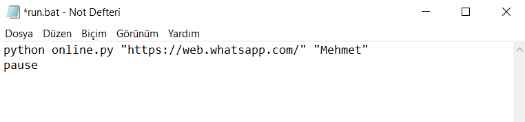
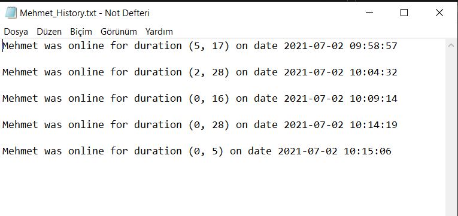
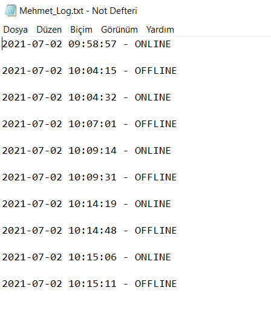

# Whatsapp Last Seen Log V2

-ENG- 

WhatsappLastSeenLogV2 is a project built with python that uses selenium to **fastest** log user's last seen status to a .txt file.
You can check the previous version on my github page. (This version is much faster than the previous one.)

Note: This project has .apk application that sends notification to mobile phone. You can contact me for apk file and detailed information.

-TR-
 
WhatsAppLastSeenLogV2, kullanıcının son görülme durumunu **en hızlı şekilde** bir .txt dosyasına kaydetmek için selenyum kullanarak python ile oluşturulmuş bir projedir.
Bir önceki versiyonunu github sayfamdan inceleyebilirsiniz. (Bu versiyon bir öncekinden çok daha hızlıdır.)

Not: Bu projenin cep telefonuna bildirim gönderen .apk uygulaması mevcuttur. Apk dosyası ve detaylı bilgi için benimle iletişime geçebilirsiniz.

## Use With .bat
python online.py "https://web.whatsapp.com/" "Name"
pause

-ENG- 

-Change the contents of the .bat file in the folder as in the example image without having to write commands for python with cmd.
(Only one user's name should be written. Multiple users are not supported.)

-save the changed file

-run the .bat file by double clicking on it

Thats All. The program will automatically create the user's history and log files for you and start writing the content.

Note: All installations related to python and selenium must be completed for the program to work.

-TR-  

-Cmd ile python için komut yazmak zorunda kalmadan, örnek görüntüdeki gibi klasördeki .bat dosyasının içeriğini değiştirin. 
(Yalnızca tek bir kullanıcının ismi yazılmalıdır. Birden fazla kullanıcı desteklenmemektedir.)

-Değiştirilen dosyayı kaydedin.

-.bat dosyasını çift tıklayarak çalıştırın

Hepsi bu kadar. Program sizin için kullanıcının geçmiş ve log dosyalarını otomatik olarak oluşturacak ve içeriğini yazmaya başlayacaktır.

Not: Programın çalışması için python ve selenium ile ilgili tüm kurulumların tamamlanması gerekir.

## Details About .txt Files

**Name_History.txt:**

**Name_Log:**

